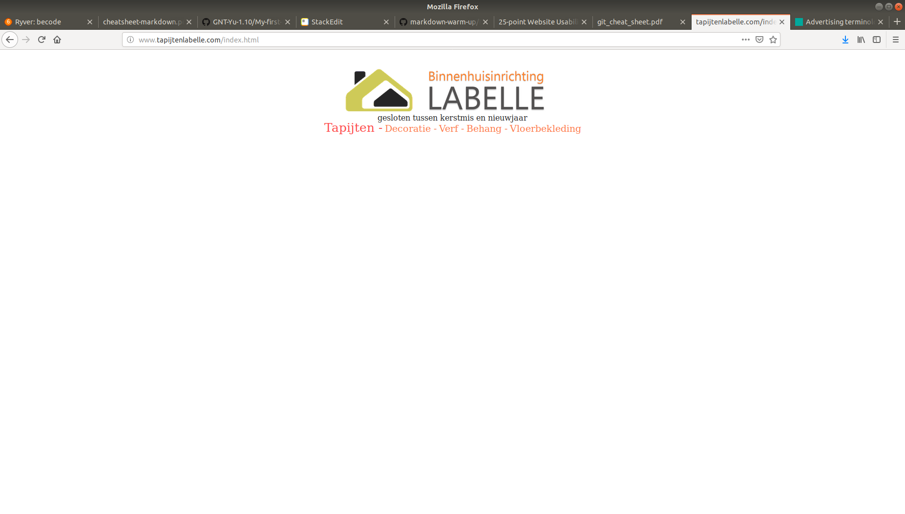
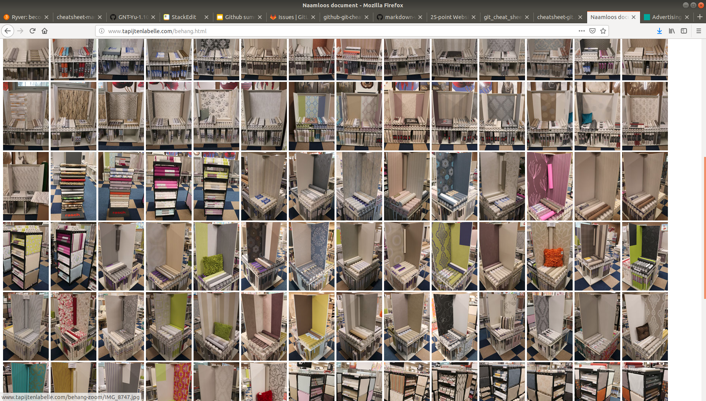

# Analysis of the Website http://www.tapijtenlabelle.com

# What website did you find (url, name,...)
**Carpet Shop website**
## Name: Binnenhuisinrichting LABELLE 
### URL: http://www.tapijtenlabelle.com
#[LABELLE](http://www.tapijtenlabelle.com)

 
# Does it get regular updates ?
No regular updates.

__Home page__ last modified November 29, 2018, 12:39:47 PM GMT+1)

There are five 'tabs' word Linking to another page

* __Tapijten__ November 29, 2018, 12:44:12 PM GMT+1
http://www.tapijtenlabelle.com/tapijten.html

* __Decoratie__ November 29, 2018, 12:41:48 PM GMT+1
http://www.tapijtenlabelle.com/decoratie.html

* __Verf__ February 26, 2015, 10:40:39 AM GMT+1
http://www.tapijtenlabelle.com/verf.html

* __Behang__ October 24, 2018, 5:38:22 PM GMT+2
http://www.tapijtenlabelle.com/behang.html

* __Vloerbekleding__ October 24, 2018, 5:39:41 PM GMT+2
http://www.tapijtenlabelle.com/vloerbekleding.html

# How did you find it ?
Raf was a customer.
Looked online to find opening hours. 

# Why does this website need an update / complete makeover ?

* The homepage consists of a *tiny* image logo in the middle of a full white page
not the __correct scale__ for a webpage

* Main navigation 
**No index** or **sitemap**

* Usability links 
The tabs do correctly link to another html location, however the pages are abscent of content. 

The most information appears on their fourth tab 'Behang'
Where finally the opening hours and address is shown. 

Visual of photos, cramped and cluttered **no whitespace** 

 
 

# Is this website active on social media ?

No

This appears to have no linked to __instagram__ or __facebook__. 

The Presence of social media is *missing*.

There is also no *email* available on their contact information.

# Make a list with the top three things you would change first (and explain why those three specifically)
# Suggestions
__Home Page__ This could profile the store better with  'Front Door' image.Photo of Building

1. Define the purpose. storefront or webshop? clear design.
2. Link to [**Google maps**](https://www.google.com/maps) for building location, allowing customers to find them, via the app
3. Provide icons or photo image as hyperlinks to link the different departments

	
